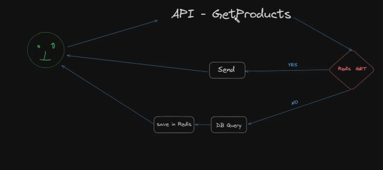

what is the meaning cache and memoization
 i give you on example:- 
 5 *5=25
 25*25=625
 10*10=100
 then again i m asking
 5*5=25 (here you cant recalculating because you have alrady calculate square of 5 then you easily used same thing in cache).

 Caching means storing data temporarily so it can be reused later instead of recalculating or fetching it again.

Memoization:-
memoization is a programming technique where a function remembers its previous results.
 if the function is call the same inout it returns the storeds value instead of recalculating.

 memoization mostly used in function side but caching used for data.

 difference between cache and memoization

cache:-
1.) used for APIs,DB calls
2.)stores external data
3.) can use tools like redis
4.) works every requests

Memoization:-
1.)Used for functions
2.)Stores function results
3.) works during execution

 Q.)any project you are using two dataabse mongoDb and redis both but why you are using two.
 becuase mongoDb is very cheap and slow why slow because they store in hard disk ,ssd but redis is store in RAM then very fast but very high expensive and issue in redis here data store in RAM if you restart ya rebot then your data is gone because here data store in RAM and RAM is temporary data storage.

that why permanent data store in mongoDb 

Examples :-

humne koi 50 products store kiya database me and kese ne request kiya nad hume response diya then hum usko store kar lege redis me fir koi v user ya same user request kare ga fir hum phlae redis databse ko dekhte hai ke yaha available hai ke nhi agar available hai then return kar dege data is se kya hoga humara response kaffi fast ho jaye ga

 

 Redis me data key value pair me data store hote hai and mongoDb me data object type me store hote hai
 

